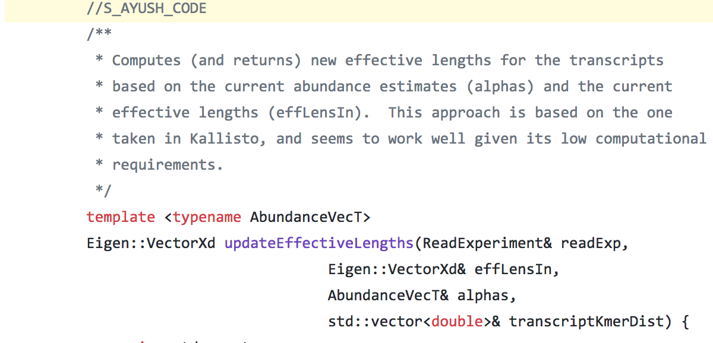
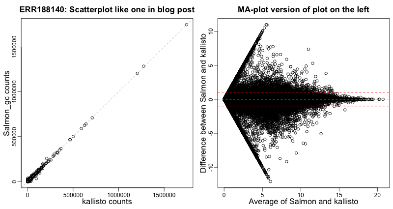
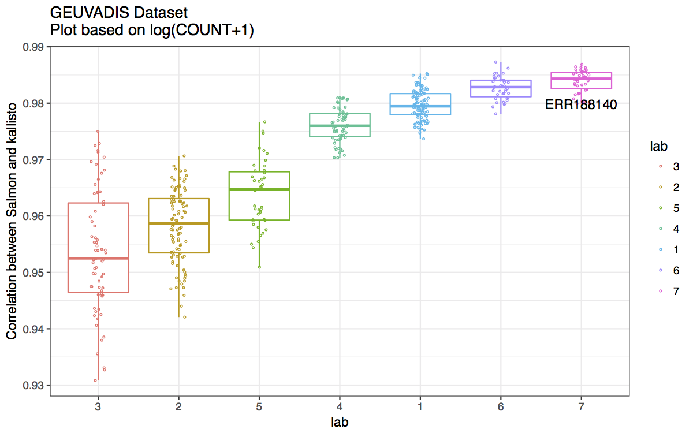
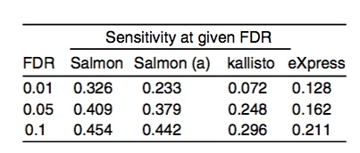
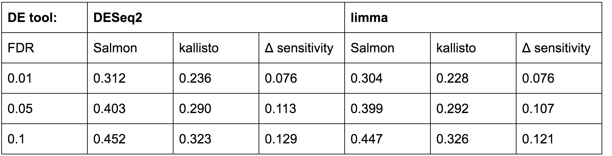
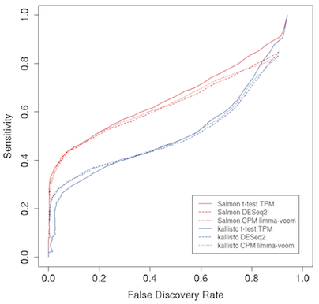
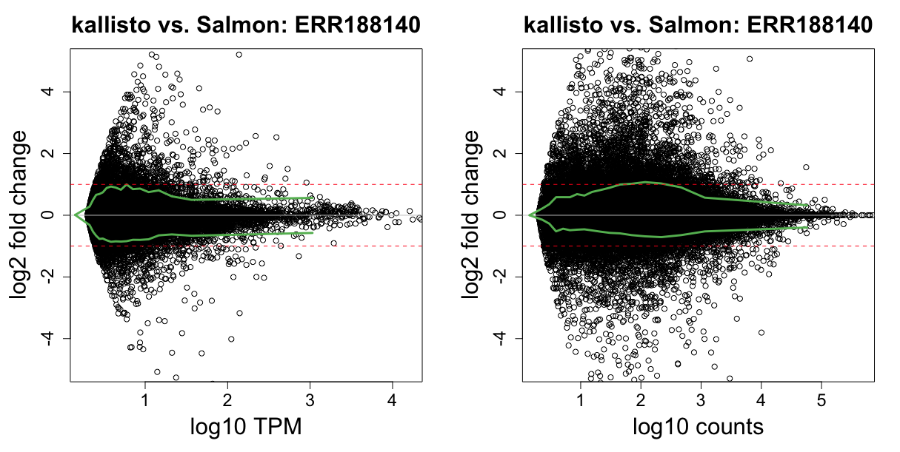
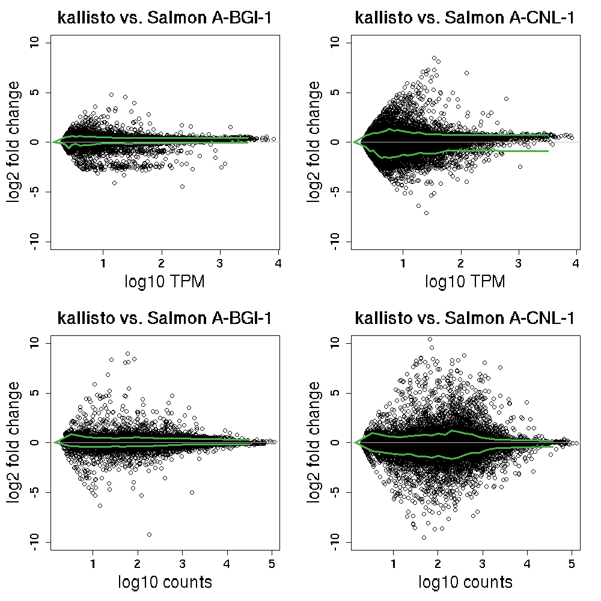
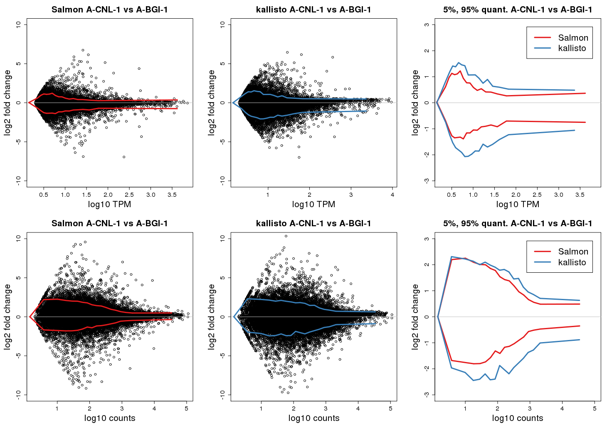
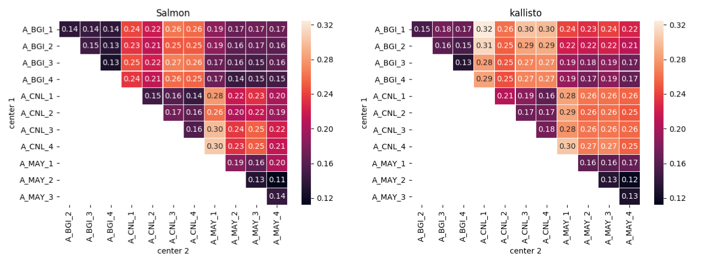

# Response to the blog post about Salmon and kallisto

Response Authors: Rob Patro, Geet Duggal, Michael I Love, Rafael A Irizarry & Carl Kingsford

August 16, 2017 <!--- Version 1.0 August 15, 2017 2:17pm -->

## 1. Introduction

After carefully considering the points made in a [recent blog post](https://liorpachter.wordpress.com/2017/08/02/how-not-to-perform-a-differential-expression-analysis-or-science/), we find that each of the allegations made is false or misleading, and we stand 100% behind the Salmon paper, our work, and our scientific ethics. We are happy to respond to the incorrect technical criticisms contained in the blog post --- indeed, we are always delighted to explain why Salmon is unique and interesting. We are distressed to have to respond to the more sensational and false accusations. Nevertheless, we respond to both types of criticisms below.

Specifically:

1.  Even on the datasets used in the blog, Salmon does not produce the same output as kallisto (see Figures 1,2,3,4,5,6,7 and Tables 2,3 below and additional experiments in the text below), and thus Salmon ≠ kallisto.
2.  The Salmon and RapMap papers credit the prior publications where technical ideas originated, citing kallisto for example 7 and 9 times, respectively. We additionally cited kallisto in the Salmon and Sailfish source code.
3.  We stand behind our Salmon publication and its analysis showing the differences between Salmon and kallisto, and we expand on those results below, showing even more cases where Salmon’s quantification appears to be better than kallisto’s.

We encourage anyone to look at the history of the development of Salmon. We would be pleased if you chose to build upon our work and codebase.

## 2. Summary

**The central argument behind the main accusation is that the creators of Salmon spiritually and literally copied the core method of kallisto and that they are therefore not only essentially the same method, but also produce "strikingly" similar outputs. Both are demonstrably false.** Salmon (Patro et al., 2017) and kallisto (Bray et al., 2016) are clearly different algorithms. This is easily noted from studying the publicly available codebase and the descriptions in related publications. For example, Salmon contains a streaming phase, which kallisto does not. In fact, the name "Salmon" comes from this streaming processing. Furthermore, Salmon’s combination of a streaming phase with fragment-level modeling of *each* fragment-to-transcript mapping is what permits the support of fragment-level GC-content bias correction. This is the reason the phrase "bias-aware" appears in the title of the Salmon paper. Parts of our software build on published ideas including ideas introduced in MMSeq (Turro et al. 2011), Roberts et al. 2011, eXpress (Roberts and Pachter, 2013), kallisto (Bray et al. 2016), Alpine (Love et al., 2016), IsoEM (Nicolae et al. 2011), and Salzman et al. (2011), among others, but we give proper attribution following best academic practices. Below we include a detailed response to each of the false accusations and critiques. But before we do this, we want to set the record straight on three particularly troubling accusations.

**The blog post links to a [github commit](https://github.com/kingsfordgroup/sailfish/commit/be0760edce11f95377088baabf72112f920874f9#diff-8341ac749ad4ac5cfcc8bfef0d6f1efaR796), dated Dec 13, 2015, showing a function that updates effective lengths, and claims that Sailfish (another piece of software we maintain; Patro et al., 2014) and Salmon use kallisto’s approach "without any attribution".** This is demonstrably false. For example, if you look at the version of the [same function a few days later](https://github.com/kingsfordgroup/sailfish/blob/39020a1c26d883bb6f1cb90b28fb03b33d4a0887/src/SailfishUtils.cpp#L670) (Dec. 18, 2015), you see that it explicitly gives credit to kallisto:

 

The direct attribution of this idea has been in the repository for over 18 months. The author of the blog post linked to an old version of the file which, unfortunately, can mislead his readers into thinking that no credit was given. What actually happened is that we implemented and incorporated an existing idea into our codebase and attributed it accordingly. Salmon, on the other hand, actually adopts a variation of a different method, due to Roberts et al. (2011), for sequence-specific bias correction, as is described and cited in the paper, and as is [mentioned in the corresponding function in the Salmon codebase](https://github.com/COMBINE-lab/salmon/blob/d061a765dc725927e8c031407ecd3ea962a2d3cd/src/SalmonUtils.cpp#L1657). The Salmon paper cites kallisto 7 times, including attributing its method for computing the effective length of transcripts.

**The blog post also claims that "Salmon is now producing almost identical output to kallisto".** First, note that for datasets in which GC-content bias is not present, as alluded to in the original Salmon paper (Figure 1b), Salmon and kallisto should produce similar results, as they are solving similar optimization problems. However, when GC-content bias is present, **Salmon produces meaningfully different results,** and the Salmon paper includes clear examples demonstrating the downstream effects of accounting for GC-bias. In contrast, the blog post author selected **a single sample** (ERR188140) from the GEUVADIS dataset and used the resulting quantifications to claim that Salmon and kallisto produce output with "very *very* strong similarity (≃)". For this one sample this result is not surprising since this particular sample has less GC-content bias. Additionally, **we ran kallisto and Salmon on this single sample and find a larger difference between the two tools than reported in the blog post on the data set selected by the post’s author.**  Here, we show an MA plot comparing the counts reported by kallisto and Salmon. Specifically, we add 1 to the counts, then plot the log-ratios

log2( {Salmongc count + 1} / {kallisto count + 1} )

versus the average of the log values. If it were true that these methods are "very *very*" similar one would see most log-ratios close to 0 (within the red lines). We include a scatter plot of these same values as the one included in the blog post, to demonstrate how deceiving count scatter plots can be in this particular context:

 

***Figure 1. Scatterplot of Salmon counts versus kallisto counts (left). MA plot (right) showing the difference between Salmon and kallisto log2 ratios versus log2 averages on same sample from the blog post. We added 1 to the counts to avoid logs of 0.***

(All code to reproduce our results is publicly available at [https://github.com/salmonteam/SalmonBlogResponse](https://github.com/salmonteam/SalmonBlogResponse).) We note that the correlation in the other GEUVADIS (Lappalainen et al., 2013) samples are generally lower than for ERR188140. Here is a boxplot of the correlations between Salmon and kallisto for samples in the entire GEUVEDIS dataset stratified by lab and with ERR188140 **annotated:**

***Figure 2: Correlation between Salmon and kallisto for all samples in the GEUVADIS dataset. The correlations are stratified by sequencing center and the one sample included in the blog post, ERR188140, is highlighted. The correlations are based on log(COUNT+1) values.***

Labs 3, 2 and 5 are those more affected by GC-content bias. To make it abundantly clear that GC-content is in fact an issue with actual experimental data, below we include several other examples. Experimentation on more than just one sample demonstrates the practical utility of this feature of Salmon.

**The blog post notes that Salmon has changed during its development.** It is true that Salmon has been continually updated as we improve it, starting from 2014 (at least 18 months before the kallisto paper) to the present. These updates have been in response to our own new ideas as well as new ideas presented in published results in the area, including the kallisto paper. The Salmon paper cites kallisto 7 times, including attributing its method for computing the effective length of transcripts, its idea of bootstrapping over the counts of equivalence classes, and the use of a fast mapping approach to improve the accuracy of alignment-free quantification. To be clear, these ideas are just a part of our software. Many of the most important ideas were developed before the kallisto repository was made public: i.e. the massively-parallel, asynchronous, streaming approach for quantification, the flexibility to use this inference approach with either pre-computed alignments or fast mapping, and the use of a lightweight mapping approach, among others. Salmon also includes numerous other ideas, such as GC bias correction, automated library type detection, a different approach to mapping, rich equivalence classes, the option to optimize a variational Bayesian objective in the offline phase, and the option to perform posterior Gibbs sampling, among others. We describe many of these ideas below, but note that it is not unusual or surprising for methods under development to change by drawing ideas from other published methods, when appropriate attribution is given, as was done here.

We strongly believe unfounded personal attacks have no place in science, but we welcome criticism and discussion of our work, as it is how we improve. We also encourage all who are interested to build upon Salmon, its ideas and its codebase. To those that incorporate our open source software into their own project, you can be assured we will not belittle your work, accuse you of stealing, or question your scientific integrity. Below please find detailed responses to each false accusation and critiques made in the blog post.

## 3. Detailed Discussion and Additional Experiments

### 3.1 Ample credit is given to kallisto and other prior work in the Salmon and related papers

**The blog post includes the accusation that "Sailfish (current version) and Salmon implemented kallisto’s pseudoalignment algorithm using suffix arrays". Furthermore, on social media the blog author has said "How would you feel if after 3 years of hard work not just of yourself but your students and collaborators you discovered that someone took all of your ideas, all the work you put into a project, implemented software replicating yours (not just in accuracy but in how it works, and which produces near identical output), wrote it up as their own put a little cherry on top, slapped their name on it then published it by deliberately concocting numerous benchmarks to give the appearance that their work was different from yours?" \[[https://twitter.com/lpachter/status/894190172824248320](https://twitter.com/lpachter/status/894190172824248320)\]**

This serious accusation is clearly false. Both Salmon and the current version of Sailfish use the fragment mapping algorithms described in the RapMap paper, co-authored by one of the Salmon authors (Srivastava et al., 2016). This RapMap paper cites kallisto 9 times in total, in both a general way (i.e., directly motivating RapMap) and specifically crediting ideas from kallisto (i.e., the relation between k-mer skipping and next informative position computation, and the use of set intersection as a consensus mechanism), granting more than ample credit. Kallisto is mentioned 24 times in the RapMap paper (4 of which are in tables or figures). The Salmon paper cites kallisto 7 times, including to specifically attribute to it the method for computing the effective lengths, its use of bootstrapping over equivalence class counts, and the use of pseudoalignment to quickly compute equivalence class counts.

Salmon uses the mapping method of RapMap. It is worth discussing the contributions of the RapMap paper and how they differ from the mapping used by kallisto ("pseudoaligment"). Bray et al. (2016) state:

> "However, it has been shown that accurate quantification does not require information on where inside transcripts the reads may have originated from, but rather which transcripts could have generated them"

and

> "A pseudoalignment of a read to a set of transcripts, *T*, is a subset, *S ⊆ T*, without specific coordinates mapping each base in the read to specific positions in each of the transcripts in *S*."

Note that Bray et al. (2016) specifically define "pseudoalignment" as excluding "specific coordinates." The focus on efficiently deriving these compatible subsets of transcripts leads Bray et al. (2016) to adopt a "likelihood function \[that\] is simpler than some other models used for RNA-seq". Kallisto’s data structures and algorithms are then designed to enable computation of the sufficient statistics of the adopted likelihood function (i.e. the equivalence class counts) without ever having to evaluate fragment-to-transcript mappings, which matches the quantification model that they adopt. Pseudoalignment, for example, can be fundamentally more efficient than the RapMap approach at computing equivalence class counts --- the sufficient statistics of kallisto’s model --- directly. This is not the approach taken in Salmon.

The approach taken by RapMap (Srivastava et al., 2016), instead, was designed to compute a specific set of mappings as well as corresponding positions for each fragment. In fact, this was the motivation behind selecting the uncompressed suffix array, augmented with a prefix lookup table, as the underlying data structure. With this approach, the positional and orientation information of each maximum mappable prefix with respect to each transcript is directly encoded, and, in fact, extra work (performing a series of rank operations using the bitvector method of Vinga (2008)) needs to be performed to decode the transcripts themselves. The design of the method described in RapMap is focused, fundamentally, around producing fragment-to-transcript mapping information. This leads to a different algorithm, different data structure, and computes different results. The RapMap approach was designed specifically with the different quantification model adopted by Salmon in mind, a model that evaluates each and every fragment-to-transcript mapping, and which cannot be learned or optimized given the equivalence class counts alone (as done in kallisto). The fact that pseudoalignments can be decoded or post-processed to produce extra information is, of course, true. However, pseudoalignments could also be produced by taking traditional (all-best) alignments and simply discarding alignment, orientation and position information to yield the transcript set. The fact that specific data structures and algorithms are designed to produce a specific type of output efficiently, and therefore adopt different perspectives on solving a problem and lend themselves to different types of extensions, is important.

**The blog post says "However Salmon did not use the EM algorithm before the kallisto preprint and program were published. It used an online variational Bayes algorithm instead. In the May 18, 2015 release of Salmon there is no mention of EM."** Salmon has always used (and still uses) an online VB algorithm, which is described in the original Salmon preprint and final paper. Furthermore, both Salmon and kallisto use an EM over equivalence classes of fragments --- an idea that far predates both tools. The Salmon paper describes the provenance of this idea, and cites kallisto along with IsoEM (Nicolae et al. 2011), MMSeq (Turro et al. 2011), Sailfish (Patro et al., 2014) and Salzman et al. (2009) as previous work. Salmon, additionally, offers the ability to use a variational Bayesian EM algorithm in its offline phase (Nariai et al., 2014).

**The Salmon paper and codebase as described above cites relevant work thoroughly.** This is because all of the Salmon co-authors strongly believe in striving to give credit where it is due and to attempt to trace the origin of even independently obtained ideas. Honest oversights are possible, and we are happy to rectify them if they are brought to our attention.

**Salmon, including many of its main ideas, was widely known in the field prior to the kallisto preprint.** The first publicly-available version of the Salmon software ([Sept. 27, 2014](https://github.com/kingsfordgroup/sailfish/releases/tag/salmon-v0.1.0)) introduced the idea of using a middle-ground between alignment-free (Sailfish) and full alignments (traditional) over 8 months before the kallisto preprint was posted (May 11, 2015) and the kallisto code made publicly available, and the ideas and work on Salmon substantially pre-date that. In fact, Zhang et al. (2015) published a paper on June 5, 2015, submitted March 19, 2015, that used Salmon. That paper included this description:

> "Salmon is based on a novel lightweight alignment model that uses chains of maximal exact matches between sequencing fragments and reference transcripts to determine the potential origin of RNA‐seq reads, and thus eliminates the dependence on a particular, predefined *k*‐mer size required by methods such as Sailfish. Salmon also relies on a novel streaming inference algorithm (an extension of stochastic collapsed variational Bayesian inference; Foulds et al., [2013](https://www.ncbi.nlm.nih.gov/pmc/articles/PMC4744958/#nph13545-bib-0008)) to improve the accuracy of transcript abundance estimates while maintaining the fast speed and limited memory requirements of Sailfish; it also produces abundance estimates in terms of TPM."

Many other groups have been actively using Salmon since before the kallisto preprint.

**Salmon uses kallisto’s EM termination criteria.** This is true. We think doing otherwise would raise other issues. What if Salmon executed more iterations of its offline phase and outperformed kallisto? Then its improvement could be attributed to the extra iterations instead of the different model, bias correction, or online phase. By using the same termination criteria for the offline phase of Salmon, we eliminate a confounding variable in the analysis. While we cite kallisto as one of the methods using EM in the Salmon paper, we apologize for not mentioning in the source code that we chose the 1e-8 value based on kallisto. In the codebase, we now cite Bray et al. (2016) for the choice of 1e-8.

**The post says "After reflecting on the Sailfish paper and results, Nicolas Bray had the key idea of abandoning alignments as a requirement for RNA-Seq quantification, developed pseudoalignment, and later created kallisto (with Harold Pimentel and Páll Melsted)."** The title of Sailfish paper contains the words "alignment-free", which indicates that it was Sailfish that first presented the key idea of abandoning alignment. That paper (Patro et al., 2014) was titled "Sailfish enables alignment-free isoform quantification from RNA-seq reads using lightweight algorithms." The algorithm described in that paper uses kmer-based perfect hashing, not alignment, for its quantification.

### 3.2 Salmon’s improvement in differential expression accuracy holds when the t-test is replaced by other approaches for calling differential expression

**The blog post author says "do not perform differential expression with a log-ratio t-test" and questions our differential expression results.** The simulation data used in this experiment in the Salmon paper was the same as the simulation data presented in the paper "*Modeling of RNA-seq fragment sequence bias reduces systematic errors in transcript abundance estimation*" authored by two of the co-authors of Salmon (Love et al., 2016). Note that the creation of this simulation dataset pre-dates the collaboration between several of the Salmon manuscript authors and was initially developed entirely independently of the algorithmic designers of Salmon.

The point of the simulation was to demonstrate that, while modeling fragment sequence bias reduces gross mis-estimation (false reports of isoform switching across labs in real data --- see for example Salmon Supplementary Figure 5 showing GEUVADIS data), the bias modeling does not lead to overall loss of signal. Consider that one could reduce false positives simply by attenuating signal or adding noise to all transcript abundances.

The t-test was chosen because it has been found to be adequate when there are a reasonable number of compared replicates, as in our case: 15 per group in the "Modeling…" paper, and 8 per group in the Salmon paper. To avoid many-to-many comparisons, e.g. CuffDiff2 (Trapnell et al. 2013) for Cufflinks, EBSeq (Leng et al., 2015) for RSEM (Li and Dewey, 2011), DESeq2 (Love et al., 2014) for Alpine, etc. we decided to keep the statistical test fixed and apply the same basic statistical test to each method.

Nevertheless, it is a relevant question whether alternative differential expression (DE) pipelines affect our results. We have now re-calculated the relevant figure and table with common DE tools. **The results remain similar to the original published results when run using the accuser’s suggested pipeline.**

Specifically, here is the original table in the Salmon paper using t-tests on log TPM:

 

***Table 1: Original FDR results using t-test from the Salmon paper.***

Here is the same table repeated using DESeq2 (left) and limma (right; Law et al. 2016) (Sensitivity at given FDR using counts):

 

***Table 2: Updated FDR results using DESeq2 (left) and limma (right)***

These new results were created using tximport followed by **DESeq2** or tximport with "lengthScaledTPM" counts followed by **limma-voom** (Law et al. 2014, 2016). We find that Salmon with GC bias correction followed by more common tools still greatly increases sensitivity in the face of differential GC dependence compared to kallisto across a wide range of empirical FDRs. With the DE tools tested above, kallisto does suffer less in sensitivity at the lowest FDR cutoff of 1% (in our re-analysis there is only a 7% difference, whereas the original analysis with t-tests of log TPM showed a 25% difference). **kallisto still has more than 10% loss in sensitivity at 5% and 10% FDR compared to Salmon, as in the original analysis using t-tests on log TPM.** These differences in method performance are due to mis-estimation of transcript abundances in the face on non-uniform coverage (see for example MA-plots in Salmon Supplementary Figure 3). We have also updated the relevant figure of the Salmon manuscript to include this new reanalysis:

 

***Figure 3: Sensitivity at various FDR using t-test (solid) and other methods (non-solid)***

Again, the results are similar between our original analysis (solid line) and that using the pipeline suggested by the blog post author (non-solid lines). Also note again that Salmon and kallisto differ significantly even when using DESeq2 or limma-voom.

Confounding of technical artifacts such as GC dependence with the biological comparison of interest does occur (see, for example [Gilad and Orna Mizrahi-Man 2015](https://www.ncbi.nlm.nih.gov/pmc/articles/PMC4516019/)). In particular, as GC dependence can be highly sample-specific (see Figure 2e in Love et al. 2016), *partial confounding* of GC dependence and biological condition can easily occur, when some of the samples in one condition exhibit greater GC dependence than the other. Finally, we note that the only hope for comparing abundance estimates from publicly available RNA-seq datasets, such as data from consortia such as GEUVADIS or GTEx, with data generated in a lab --- even solely *descriptive* comparisons, e.g. which isoforms are expressed in hippocampus --- is to model and correct for the most common technical biases during abundance estimation.

**The results of reduced false positive DE calls claimed in the Salmon paper (Figure 1d) are also similar, no matter whether one uses the t-test or the blog author’s suggested pipeline.** We repeated the analysis of Figure 1d from the Salmon paper using the pipeline suggested by the blog post author. The results are qualitatively the same: Salmon still reduces the number of DE calls by approximately the same factor:

*As in the Salmon paper, using log(TPM + 1) and filtering out transcripts with mean(TPM) &lt; .01:*

<blockquote>
Salmon: 1171 DE transcripts

kallisto: 2620 DE transcripts

(kallisto = 2.2x more False Positives)
</blockquote>

*Now using DESeq2, and filtering out transcripts with &lt; 5 samples with normalized count &gt;= 10:*

<blockquote>
Salmon: 1605 DE transcripts

kallisto: 2906 DE transcripts

(kallisto = 1.8x more False Positives)
</blockquote>

*Now using limma, with limma default filtering (&lt; 5 samples with CPM &gt;= 10/L, where L is millions of reads for the smallest library):*

<blockquote>
Salmon: 1064 DE transcripts

kallisto: 2410 DE transcripts

(kallisto = 2.3x more False Positives)
</blockquote>

On the GEUVADIS comparison test included in the Salmon paper, no matter whether you use the t-test, DESeq2, or limma to call DE, Salmon produces far fewer DE calls.

**We are unable to reproduce the results of the blog post showing the overlap in DE predictions on the the Trapnell et al. (2013) data set.** In the blog post, Venn diagrams with large overlaps are shown between the DE calls of Salmon and kallisto when run on the data from Trapnell et al., 2013. Specifically, the numbers reported on the blog are:

     189 (kallisto), 7190 (both), 164 (Salmon)    unique transcripts are 5% of the shared

We have been unable to reproduce these numbers and no code or details were provided by the blog author to compute them. Using the pipeline described in English by the blog’s author, we obtain different results:

     875 (kallisto), 11,000 (both), 808 (Salmon)   unique transcripts are 15% of the shared

Our numbers were generated by running Salmon with the --gcBias option and kallisto on the HiSeq samples, then running tximport, and then DESeq2 (this is the pipeline suggested by the post’s author). We used the latest versions of all software (as of August 11, 2017: Salmon 0.8.2, kallisto 0.43.1, tximport 1.4.0, DESeq2 1.16.1), and latest Gencode transcripts (version 26 CHR transcripts.fa). Therefore, on the data set selected by the post’s author, the DE calls are much more different from each other than claimed in the original post. (We also tried using the read start bias option in kallisto, which gave numbers of 950 (kallisto), 10901 (both), 907 (salmon), such that unique transcripts are 17% of the shared.)

**However, even if we were able to reproduce the numbers given in the blog post, results on the single selected dataset are not conclusive for showing the benefit of bias modeling.** The selected dataset is a controlled experiment (IMR90 cell line) with extremely different conditions (HOXA1 knockdown) and apparently minimal sample-to-sample bias.

The R code to reproduce the above results to obtain the transcripts with FDR &lt; .05 is:

    txi <- tximport(files, type=type, txOut=TRUE)
    condition <- factor(rep(1:2,each=3))
    dds <- DESeqDataSetFromTximport(txi, data.frame(condition), ~condition)
    dds <- estimateSizeFactors(dds)
    keep <- rowSums(counts(dds, normalized=TRUE) >= 1) >= 3
    dds <- dds[keep,]
    dds <- DESeq(dds)
    res <- results(dds, alpha=.05)
    rownames(res)[which(res$padj < .05)]

We used Gencode Release 26 (GRCh38.p10) CHR transcripts, quantifying the HiSeq samples from Trapnell et al. (2013) (SRR493366-SRR493371). Additional code to reproduce the
results from this document is [here](https://github.com/salmonteam/SalmonBlogResponse).

**3.3. Salmon and kallisto differ in their output even on the samples selected by the blog’s author**

**Analysis of the ERR188140 sample selected by the blog post’s author shows marked differences between Salmon and kallisto.** Much of the blog post focuses on the high apparent correlation between Salmon and kallisto quantifications for a single sample, ERR188140, from the GEUVADIS project. We also quantified this single sample using Salmon with fragment GC bias correction and kallisto with read start bias correction. Note that this sample was prepared by the LUMC sequencing center and had minimal fragment GC bias among the various centers of the GEUVADIS project (see t' Hoen et al. (2013) Supplementary Figure 6B). Therefore, for such a sample with minimal GC bias, we do not expect large differences in quantification between Salmon and a fragment-GC-bias-naive method. A goal of bias correction would be that for low-to-no bias data, quantification is not changed very much, but that having the correction allows us to aggregate data meaningfully across batches, labs, centers, consortia, etc. Nevertheless, when we perform this analysis we obtain a correlation between the log(counts+1) of 0.9816473, not 0.9955965 as reported by the blog post. Note that for counts here, we use "lengthScaledTPM" counts derived from abundances (Soneson et al., 2015), as these contain effective transcript length correction — looking at the estimated counts alone would reflect none of the bias correction, if a sample exhibits bias.

A major problem with the use of correlation is that the summary is hard to interpret: how high must the correlation be to declare two methods exhibit "very *very* strong similarity (≃)"?. We note that a recently published paper by an independent group (Zhang et al., 2017) found that the correlation between TIGAR2 (Nariai et al., 2014) and RSEM (Li and Dewey 2011) was 0.970 (See Figure 5 in Zhang et al., 2017), between RSEM and Salmon (using alignments) was 0.997, and between RSEM and Cufflinks (Trapnell et al., 2010) was 0.946. All of these are comparable to the correlation of 0.971 reported by this group for Salmon (without GC correction) and kallisto. So which are "very very" similar?

|   **Methods**                                | **correlation** |
|----------------------------------------------|-----------------|
| RSEM and Salmon (using alignments)           | 0.997           |
| Salmon (without GC correction) and kallisto. | 0.971           |
| TIGAR2 and RSEM                              | 0.970           |
| RSEM and Cufflinks                           | 0.946           |
| eXpress and Kalisto                          | 0.790           |

***Table 3: Correlations between methods reported by Zhang et al. (2017)***

Note that the 0.971 value is computed **without** using the GC-content bias correction feature of Salmon. It is expected that Salmon, without the GC bias correction feature, will be similar to kallisto. But it is the Salmon software’s streaming algorithm phase, distinct data structures, and different model that permitted the efficient inclusion of a fragment-level GC bias correction feature. The Salmon paper focused on this aspect of the software.

To understand why correlations higher than 0.97 do not necessarily mean methods are "very very" similar consider this well-known formula:

If *X* and *difference* are independent: 

 

Suppose *X* is *log2(counts+1)* computed with kallisto. The standard deviation of X is therefore about 3.4. Suppose that *X+difference* is *log2(count+1)* computed with Salmon and that the standard deviation of the *difference* is 0.5: this means that a substantial difference of 25% between reported counts is typical. Using the formula above, despite the substantial differences, this gives us a correlation between *X* and *X+difference* of 0.99!

Due to this property of the correlation, much more interpretable statistical summaries relate to how much the difference varies, for example the standard deviation of the difference or the median absolute difference. If using MAD, care should be taken due to the large number of transcripts that are 0 in all methods. This is why MA plots are a better visualization tool than scatter plots: the difference is represented in the y-axis. Below, we show an MA plot comparing kallisto to Salmon quantifications for ERR188140 (below) which reveals that, although the methods are in close agreement on this sample prepared by a center with low apparent GC bias, **the quantifications are also clearly not identical for all transcripts**. Here, we draw 5% and 95% quantile lines over the MA plot (green lines). The quantile lines show the 5% and 95% quantile of log2 fold change of difference between methods, binning transcripts by their average signal (x-axis). We can see that, in the middle range of either TPM or count, nearly 10% of transcripts have double or half the estimated TPM or count across the two methods (above or below a log2 fold change of 1 or -1, red dotted lines). Again, these are not identical quantifications. **Furthermore, such quantiles of log2 fold changes across method widen significantly when a sample actually exhibits fragment GC bias, as we will show next.**

 

***Figure 4: MA plots comparing kallisto and Salmon.***

Note that the blog author’s statement that "the dataset was chosen to be older (when bias was more prevalent)" incorrectly assumes that older datasets produce more GC-content bias. A more informed assumption is that GC bias in sequencing data originates with PCR amplification and depends on thermocycler ramp speed (see, for example, Aird (2011) or t’ Hoen (2013)), and not from sequencing machines or reverse transcription protocols which may have improved in the past 5 years.

**3.4 Salmon’s quantifications are more consistent when comparing the same sample across labs than kallisto’s**

**Examining replicate samples processed by different labs reveals that Salmon and kallisto do not exhibit "very very strong similarity", and Salmon’s quantifications are more consistent, when comparing quantification of the same sample across labs, than kallisto’s.** In the blog post, individual samples processed by both tools are compared in which the correlation in TPM or log TPM between Salmon with fragment-GC bias correction and kallisto is greater than 0.995. However, this is not nearly conclusive that the methods are identical. The key advantage to Salmon is accurate quantification on *all* samples, and higher consistency in quantification across labs or batches. For example, in the Salmon paper we show that Salmon with GC bias correction on samples from the SEQC benchmarking dataset has lower mean absolute error in quantification compared to kallisto, when comparing the same sample within the same lab, and especially when comparing the same sample across lab (Supplementary Figure 4). We can zoom into what these errors look like for individual samples, e.g. sample "A" from SEQC sequenced by two labs: BGI and CNL. We constructed MA plots of kallisto vs. Salmon, and drew 5% and 95% quantile lines for the log2 fold change between methods along the average signal. We see that, while for the BGI lab the quantifications across method are somewhat similar, for CNL the quantifications from Salmon and kallisto are very different for a number of transcripts (top row: TPM, bottom row: counts using tximport with "lengthScaledTPM" counts). Note the wide scale on the y-axis (consider, log2 of 5 = 32-fold change). **These are clearly not identical methods.**

 

***Figure 5: MA plots comparing Salmon and kallisto for two different sequencing centers (BGI and CNL)***

We can make MA plots for each method, to see how *well* they can quantify **the same sample** across different labs. Either on the TPM (top row) or the count scale (bottom row), we see that **Salmon has greater consistency when comparing quantification of the same sample across labs.** The plots of the right side overlay the 5% and 95% quantile lines for both methods, where a narrower band indicates more consistent estimation. This increased consistency is due to Salmon’s unique ability to model fragment sequence bias.

 

***Figure 6: MA plots showing different consistency across data centers for Salmon and kallisto.***

To provide a systematic comparison of all SEQC samples without making dozens of MA-plots, we computed a one-number summary for each MA-plot related to the extent of inter-sample differences. For each pair of samples, we compute the median absolute deviation (MAD) between the samples (where the signal is given by log2(TPM + 1)), and visualize the results in a heatmap (Figure 8). Again, we observe the same trend as above. The boxes of bright color for kallisto indicates higher absolute differences in quantifying the same sample across center. Salmon yields a smaller MAD between samples, and, in particular, **Salmon has greater consistency when comparing quantification of the same sample across labs.** For a systematic figure of this analysis of SEQC samples, see Supplementary Figure 4 in the Salmon paper.

 

***Figure 7: MAD between samples using Salmon (left) and kallisto (right).***

### 3.5 Salmon’s algorithm, model, data structures, and implementation differ from kallisto’s

**Salmon’s streaming algorithm and data structures allow it to adopt a different model and compute different abundance estimates.** Much of Salmon’s model building and quantification is done while streaming the reads through the algorithm. This is the "online" phase described in the paper. Kallisto contains nothing similar. In addition to enabling the ability to build accurate bias and parameter models, the fact that the streaming phase models the full probability of each fragment (rather than simply reducing it to a count) is what enables Salmon to build rich equivalence classes (an idea that does not exist in e.g., kallisto or any other quantification tool to the best of our knowledge). This associates, within each equivalence class, an affinity of the fragments for each transcript. This can improve quantification accuracy over "uniform" equivalence classes, as has been demonstrated in Zakeri et al. (2017). Further, the flexibility enabled by modeling each fragment in full is instrumental to expanding and improving the likelihood factorization as has been done in Zakeri et al. (2017). The completely different data structures used in RapMap also allows efficient inclusion of more alignment-level information, and more sensitive and specific filtration mechanisms for producing candidate read mappings from collections of hits, as explored in the preprint by Sarkar et al. (2017). Further, the specific data structures, data representation, and matching algorithms (e.g., the MMP, originally due to Dobin et al. \[2013\]) adopted by RapMap are what helps to enable the efficiency of selective alignment (another idea being developed in the open).

### 3.6 The running time discussion presented in the Salmon paper is accurate

**Kallisto is faster when using a small number of threads.** This is true. If you need to quantify RNA-seq abundance using a few threads, then kallisto may be faster. We did not consider or test this case in the Salmon paper. We more typically use 15 or more threads when processing RNA-seq samples, and in those cases, the running times --- as shown by the figure included in the post --- are nearly the same. The recent study of Zhang et al. (2017) performed their own timing analysis with 8 threads, another common choice, and found the timing for Salmon (6 min) and kallisto (7 min) to be similar.

## 4. Conclusion

We show above that Salmon more than adequately cites kallisto, both in the source code and repeatedly in the relevant papers, attributing to it the relevant published ideas that are incorporated into Salmon. We also show that the conclusions in the Salmon paper hold even when using the samples selected by the blog post author, and even when using alternative techniques to assess differential expression. We also provide a number of examples showing the different (and better) performance of Salmon, augmenting those already contained in the Salmon paper. We describe above --- largely reiterating what is in Salmon paper --- the differentiating ideas that are present in Salmon that lead to its improved performance. We encourage all to build upon, improve, and modify our code and published ideas; we will support you in that endeavor.

We welcome any feedback, thoughts or comments on this document. We can be reached at [SalmonSoftwareTeam@gmail.com](mailto:SalmonSoftwareTeam@gmail.com).

The version of this document is 1.0 (August 16, 2017).

## 5. References

Al Seesi et al. "Bootstrap-based differential gene expression analysis for RNA-Seq data with and without replicates." *BMC Genomics* **15**(Suppl 8): S2 (2014). \[The "IsoDE" paper\]

Aird et al. "Analyzing and minimizing PCR amplification bias in Illumina sequencing libraries." *Genome Biol.* **12**(2):R18 (2011).

Anders and Huber. "Differential expression analysis for sequence count data." *Genome Biol.* **11**(10):R106 (2010).

Bray et al. "Near-optimal probabilistic RNA-seq quantification." *Nature Biotechnology* **34**(5):525-527 (2016). \[The "kallisto" paper\]

Dobin et al. "STAR: ultrafast universal RNA-seq aligner." *Bioinformatics* **29**(1):15-21 (2013).

Foulds et al. "Stochastic collapsed variational Bayesian inference for latent Dirichlet allocation." In *Proc. 19th ACM SIGKDD Int. Conf. Knowledge Discov. & Data Mining*, pages 446–454 ACM (2013).

Gilad and Mizrahi-Man. "A reanalysis of mouse ENCODE comparative gene expression data." *F1000Research* **4**:121 (2015).

Jiang and Wong. "Statistical inferences for isoform expression in RNA-Seq." *Bioinformatics* **25**(8):1026–1032 (2009).

Lappalainen et al. "Transcriptome and genome sequencing uncovers functional variation in humans." *Nature* **501**:506–511 (2013). \[The "GEUVADIS" paper\]

Law et al. "voom: precision weights unlock linear model analysis tools for RNA-seq read counts" *Genome Biology* **15**:R29 (2014).

Law et al. "RNA-seq analysis is easy as 1-2-3 with limma, Glimma and edgeR" Version 2*. F1000Research* **5**:1408 (2016).

Leng et al. "EBSeq-HMM: a Bayesian approach for identifying gene-expression changes in ordered RNA-seq experiments." *Bioinformatics* **31**(16):2614-22 (2015).

Li and Dewey. "RSEM: accurate transcript quantification from RNA-Seq data with or without a reference genome." *BMC Bioinformatics* **12**:323 (2011).

Love et al. "Moderated estimation of fold change and dispersion for RNA-seq data with DESeq2." *Genome Biology* **15**(12):550 (2014). \[The "DESeq2" paper\]

Love et al. "Modeling of RNA-seq fragment sequence bias reduces systematic errors in transcript abundance estimation." *Nature Biotechnology* **34**(12):1287-1291 (2016).

Nariai et al. "TIGAR2: sensitive and accurate estimation of transcript isoform expression with longer RNA-Seq reads." *BMC Genomics* **15** Suppl 10:S5 (2014).

Nicolae et al. "Estimation of alternative splicing isoform frequencies from RNA-Seq data." *Algorithms Mol Biol.* **6**(1):9 (2011). \[The "IsoEM" paper.\]

Patro et al. "Sailfish enables alignment-free isoform quantification from RNA-seq reads using lightweight algorithms." *Nature Biotechnology* **32**(5):462-4 (2014). \[The "Sailfish" paper\]

Patro et al. "Salmon provides fast and bias-aware quantification of transcript expression." *Nature Methods* **14**:417–419 (2017). \[The "Salmon" paper\]

Roberts and Pachter. "Streaming fragment assignment for real-time analysis of sequencing experiments." *Nature Methods* **10**(1):71-3 (2013).

Roberts et al. "Improving RNA-Seq expression estimates by correcting for fragment bias." *Genome Biology* **12**(3):R22 (2011).

Salzman et al. "Statistical Modeling of RNA-Seq Data." *Stat Sci.* 26(1):10.1214/10-STS343 (2011).

Sarkar et al. "Towards Selective-Alignment: Producing Accurate And Sensitive Alignments Using Quasi-Mapping." *bioRxiv* preprint. doi: [*https://doi.org/10.1101/138800*](https://doi.org/10.1101/138800) (2017).

Soneson et al. "Differential analyses for RNA-seq: transcript-level estimates improve gene-level inferences." Version 2. *F1000Research* **4**:1521 (2015). \[The tximport paper\]

Srivastava et al. "RapMap: a rapid, sensitive and accurate tool for mapping RNA-seq reads to transcriptomes." *Bioinformatics* **32**(12):i192-i200 (2016). \[The "RapMap" paper\]

't Hoen et al. "Reproducibility of high-throughput mRNA and small RNA sequencing across laboratories." *Nature Biotechnology* **31**(11):1015-22 (2013).

Trapnell et al. "Transcript assembly and quantification by RNA-Seq reveals unannotated transcripts and isoform switching during cell differentiation." *Nature Biotechnology* **28**(5):511-515 (2010).

Trapnell et al. "Differential analysis of gene regulation at transcript resolution with RNA-seq." *Nature Biotechnology* **31**(1):46-53 (2013).

Turro et al. "Haplotype and isoform specific expression estimation using multi-mapping RNA-seq reads." *Genome Biology* **12**(2):R13 (2011). \[The "MMSeq" paper\]

Zakeri et al. "Improved data-driven likelihood factorizations for transcript abundance estimation." *Bioinformatics* **33**(14):i142-i151 (2017).

Zhang et al. "Evaluation and comparison of computational tools for RNA-seq isoform quantification." *BMC Genomics* **18**(1):583 (2017).

Zhang et al. "AtRTD–a comprehensive reference transcript dataset resource for accurate quantification of transcript‐specific expression in Arabidopsis thaliana." *New Phytologist* **208**(1):96-101 (2015).
