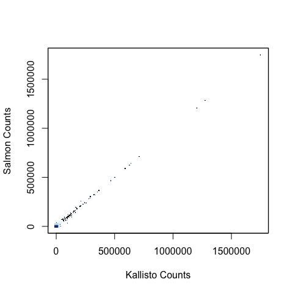
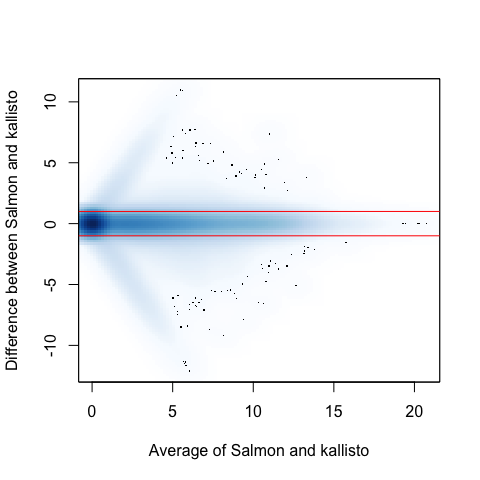
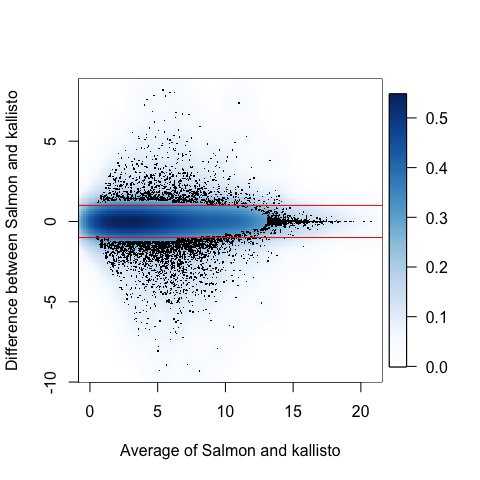

Smoothscatter version of MA-plot
--------------------------------

The plots in Figure 1 of the response contains close to 200,000 points.
As a result points in a scatterplot are plotted on top of each and it is
hard to see how they are distributed. If you are interested in learning
more about the distribution of points, there are [several functions
R](https://www.r-bloggers.com/5-ways-to-do-2d-histograms-in-r/). One is
using the function `smoothScatter`.

By default shades of blue are used to show where the data are. Darker
means more data. Below is the scatterplot from the blog post using this
function. We set the `bandwith` parameter to `5000` to avoid a warning.
This tells the `smoothScatter` function to use a smoother with a 5000 x
5000 smoothing window.

    salmon <- tximport::tximport("../GEUV_quants/ERR188140/salmon_gc/quant.sf",
                                 type="salmon", txOut=TRUE, countsFromAbundance="lengthScaledTPM")
    kallisto <- tximport::tximport("../GEUV_quants/ERR188140/kallisto/bias/abundance.h5", 
                                   type="kallisto", txOut=TRUE, countsFromAbundance="lengthScaledTPM")

    smoothScatter(kallisto$counts, salmon$counts, bandwidth = 5000,
                  xlab = "Kallisto Counts", ylab = "Salmon Counts")

Where did all the data go? If you look very closely at the bottom left
corner you see a dark blue square. Over 98% of the data is down in that
little corner.

    mean(kallisto$counts < 5000 & salmon$counts<5000)

    ## [1] 0.9883406

Just like the original plot, this smoothscatter version is
uninformative. So now let's look at the MA-plot. The log scale permits
us to use a much smaller bandwidth. Here we use 0.5 x 0.5 so that we can
distinguish points within 0.25 of 0, within 0.5, and so on.

    a <- log2(kallisto$counts+1)/2+log2(salmon$counts+1)/2
    m <- log2(salmon$counts+1) - log2(kallisto$counts+1)
    smoothScatter(a, m, bandwidth = 0.5,
                  ylab = "Difference between Salmon and kallisto",
                  xlab = "Average of Salmon and kallisto")
    abline(h=c(-1,1), col = "red")

Now we see a bit more, but most points appear to be at the location
associated with 0 counts for both methods. This is because:

    mean(kallisto$counts==0 & salmon$counts==0)

    ## [1] 0.4429371

For a more informative plot, we can remove these and remake the plot:

    ind <- which(!(kallisto$counts==0 & salmon$counts==0))
    a <- a[ind]
    m <- m[ind]
    smoothScatter(a, m, bandwidth = 0.5,
                  ylab = "Difference between Salmon and kallisto",
                  xlab = "Average of Salmon and kallisto")
    abline(h=c(-1,1), col = "red")

Now, where did all those points in the original MA-plot go? If you look
closely you can see see light blue right outside the red-lines. By
default the function shows the 100 points from areas of lowest regional
densities. Given that we start with over 100,000 points, we can use the
option `nrpoints` to show, say, the 5,000 points that are outside of the
areas of lowest regional densities. area:

    smoothScatter(a, m, bandwidth = 0.5, nrpoints = 5000,
                  ylab = "Difference between Salmon and kallisto",
                  xlab = "Average of Salmon and kallisto")
    abline(h=c(-1,1), col = "red")

This gives us a better idea of where all the data are. But we are still
missing something: a legend mapping the colors to densities. Adding a
legend is not that easy. But it is
[doable](https://stackoverflow.com/questions/14271584/r-legend-for-color-density-scatterplot-produced-using-smoothscatter):

    legend <- function(){
      xm <- get('xm', envir = parent.frame(1))
      ym <- get('ym', envir = parent.frame(1))
      z  <- get('dens', envir = parent.frame(1))
      colramp <- get('colramp', parent.frame(1))
      fields::image.plot(xm,ym,z, col = colramp(256), legend.only = T, add =F)
    }

    par(mar = c(5,4,4,5) + .1)
    smoothScatter(a, m, bandwidth = 0.5, nrpoints = 5000,
                  ylab = "Difference between Salmon and kallisto",
                  xlab = "Average of Salmon and kallisto",
                  postPlotHook = legend)
    abline(h=c(-1,1), col = "red")

This plot helps us visualize important characteristics of the data, such
as:

    cat(sum(abs(m)>1), " points (",round(mean(abs(m)>1)*100,1), "%) have fold-chages above 2", sep = "" )

    ## 7983 points (7.2%) have fold-chages above 2

    cat(sum(abs(m)>log2(1.5)), " points (",round(mean(abs(m)>log2(1.5))*100,1), "%) have fold-chages above 1.5", sep = "" )

    ## 14105 points (12.7%) have fold-chages above 1.5

    cat(sum(abs(m)>log2(1.25)), " points (",round(mean(abs(m)>log2(1.25))*100,1), "%) have fold-chages above 1.25", sep = "" )

    ## 24356 points (21.9%) have fold-chages above 1.25

Remember we have removed the transcripts for which both methods report 0
counts. Also note that some of the remaining points have 0 counts for
one method and and the y-axis is not technically the log fold change
since we add the 1 to avoid 0s. We can easily remake these figure for
transcripts that are larger than, say, 1 in both.

    ind <- which(kallisto$counts>1 & salmon$counts>1)
    a <- log2(kallisto$counts)/2+log2(salmon$counts)/2
    m <- log2(salmon$counts) - log2(kallisto$counts)
    a <- a[ind]
    m <- m[ind]
    par(mar = c(5,4,4,5) + .1)
    smoothScatter(a, m, bandwidth = 0.5, nrpoints = 5000,
                  ylab = "Difference between Salmon and kallisto",
                  xlab = "Average of Salmon and kallisto",
                  postPlotHook = legend)
    abline(h=c(-1,1), col = "red")

Finally, for comparison purposes, here is what this MA-plot would look
like if the difference between the two methods was simulated as a
normally distributed with very small differences. Specifically we
simulate with a standard error of 0.01 in the log (base 2) scale:

    m_small <- rnorm(length(m), 0, 0.01)

    par(mar = c(5,4,4,5) + .1)
    smoothScatter(a, m_small, bandwidth = 0.5, nrpoints = 5000,
                  ylab = "Difference between two similar methods (simulated)",
                  xlab = "Average of Salmon and kallisto",
                  postPlotHook = legend, ylim = range(m))
    abline(h=c(-1,1), col = "red")

